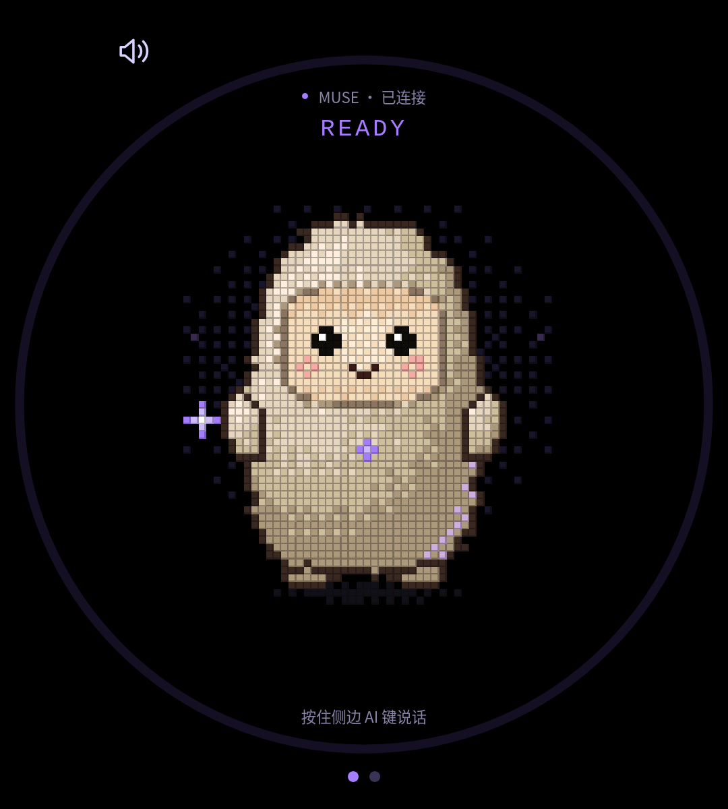

# PomTum Muse

**让你的 Muse 住进一台 Linux 小设备。** 按住实体 AI 键说话，松开后发送；看它思考、听它回答，再戳一下角色。

[English](README.en.md) · [上游 SDK](https://github.com/facebookincubator/muse-gadget-sdk) · [开发指南](docs/development.md) · [许可证与素材说明](THIRD_PARTY.md)



这是一个独立的社区兴趣项目，使用完整 **Muse Linux Gadget SDK**，把官方 ESP32 的主界面风格搬到 Linux 触屏设备上。我们在一台 4 英寸、1080×1200 AMOLED、RK3576 / Ubuntu 24.04 ARM64 设备上玩起来了。欢迎拿自己的设备试试，也欢迎贡献适配。

## 可以怎么玩

- **实体 AI 键对话**：按住录音、松开发送，无需屏幕麦克风按钮；失去窗口焦点后释放按键和录音。
- **完整 Linux 能力**：保留 `system.run`、`file.read`、`file.write`、`device.health`，以安装时选定的普通用户权限执行。
- **会动的主屏**：待机、聆听、思考、讲话、触摸回应；讲话时用本机音频能量驱动嘴部动画。
- **本机朗读与字幕**：Piper 中文语音；主屏最多三行，朗读结束约 3 秒后清空，静音时最终回复约 12 秒后清空。完整内容仍在本机对话记录中。
- **设置页添加 SDK 令牌**：密码输入框、保存后清空，仅显示是否配置；令牌写入本机 SDK 的 root 专用文件，不进入浏览器历史或对话存储。
- **使用现有网络**：复用 Linux 默认连接；我们的设备使用 eSIM，也可使用自己已有的宿主机网络转发。配对时选择 **Use current connection**，无需另填 Wi-Fi 密码。

这里使用的是官方 ESP32 角色动画，**不是 Muse App 的实时 3D 模型**。本机声音也不是 Muse 官方声音；嘴部动画是五档音量联动，不是逐音素口型。Muse 服务可用性取决于你的账号、SDK 权限及网络条件，本项目不提供账号或网络服务。

## 安装指南

以下命令在目标 Linux 设备上执行。已安装并配对官方 SDK 的玩家可以跳过第 2 步。

### 1. 准备环境与源码

需要 systemd、Python 3.10+、Node.js 22.12+、GCC、Firefox、PipeWire，以及用于首次手机配对的 Bluetooth LE。桌面用户需已有麦克风、扬声器和专用按键设备的使用权限。其他 Linux / 硬件组合需要自行验证。

Ubuntu 示例（Node.js 请自行安装满足版本的发行版）：

```sh
sudo apt update
sudo apt install git build-essential python3-venv pipewire-bin firefox
git clone https://github.com/pomtum/pomtum-muse.git
cd pomtum-muse
node --version
```

### 2. 安装 SDK，并与 Muse App 配对

在 Muse App 的 **Settings → Devices** 开启 **Developer mode**，按 App 指引申请自己的 Gadget SDK token。上游入口：[gadgets.muse.ai](https://gadgets.muse.ai/)。

```sh
bash sdk/install.sh --from "$PWD/sdk" --run-as "$USER"
```

在安装器的隐藏输入提示中粘贴自己的令牌。不要把令牌放在命令行参数、截图、Issue 或 Git 文件里。安装器会安装 SDK 服务并打开 BLE 配对；在手机 **Add Device** 中选择终端显示的设备，网络页面选择 **Use current connection**。

自动化安装可使用 `--sdk-token-file /路径/私有令牌文件`；文件需仅限所有者访问，例如权限 `600`。也可用 `--sdk-token-file -` 从重定向的标准输入读取到 EOF；此时标准输入只能放令牌，不能同时用于 `curl | bash` 传入脚本。旧的 `--sdk-token VALUE` 用法已移除。

需要再次打开配对时：

```sh
sudo musegadget pair
```

**后续添加或更换令牌**：打开本机 PomTum Muse → 点底部第二个圆点或左滑 → **SDK 令牌** → 粘贴 → **保存**。此入口要求 SDK 服务和本项目桥接服务已运行。保存不会中断现有连接或自动重新配对；未配对的设备仍需完成上面的手机步骤。

### 3. 本地生成角色资源并构建界面

```sh
python3 scripts/prepare-avatar.py
(cd ui && npm ci && npm run build)
```

脚本从固定的官方 SDK commit 下载角色源文件，检查 SHA-256，再用 GCC 在本机生成动画帧。角色源文件和生成素材不随本仓库分发，也不包含在本项目 Apache 代码许可中；使用前请阅读 [素材说明](THIRD_PARTY.md)。

### 4. 准备本机语音

以下以 Piper 中文 `zh_CN-huayan-medium` 为例。引擎和模型单独安装；请先查看 [Piper 引擎许可](https://github.com/OHF-Voice/piper1-gpl) 与 [模型卡](https://huggingface.co/rhasspy/piper-voices/blob/main/zh/zh_CN/huayan/medium/MODEL_CARD)。

```sh
python3 -m venv "$HOME/.local/share/pomtum-muse/voice-venv"
"$HOME/.local/share/pomtum-muse/voice-venv/bin/pip" install piper-tts==1.8.0
"$HOME/.local/share/pomtum-muse/voice-venv/bin/python" -m piper.download_voices \
  --data-dir "$HOME/.local/share/pomtum-muse/voices" zh_CN-huayan-medium
```

模型 `.onnx` 和同名 `.onnx.json` 需要放在一起。安装器会检查模型和 Python 环境，不会自动下载模型。

### 5. 安装界面、按键与声音服务

确保当前 `$USER` 就是第 2 步选定的桌面用户：

```sh
sudo bash scripts/install-companion.sh \
  --user "$USER" \
  --voice-model "$HOME/.local/share/pomtum-muse/voices/zh_CN-huayan-medium.onnx" \
  --voice-python "$HOME/.local/share/pomtum-muse/voice-venv/bin/python"
```

可先追加 `--dry-run` 只检查环境并查看安装计划。默认专用输入设备名为 `adc-keys-ai`，Linux key code 为 `30`。其他硬件追加 `--key-name '你的专用设备名' --key-code 数字`。**应选择专用 AI 按键设备**：Linux 独占抓取作用于整个 input device，不适合普通键盘。安装器不会修改用户组或按键权限，详见 [按键适配说明](device-io/README.md)。

安装完成后，在该用户已经登录桌面的情况下启动：

```sh
sudo systemctl restart musegadget.service pomtum-muse-bridge.service pomtum-muse-io.service
```

从应用菜单打开 **PomTum Muse**，或运行：

```sh
/opt/pomtum-muse/bin/open-companion
```

界面使用独立 Firefox profile，地址为 `http://127.0.0.1:17863/`，密码保存已关闭。安装器只启用服务；启动命令由你明确执行，不会在安装中途打断会话。

## 日常使用与排查

| 操作 / 现象 | 方法 |
| --- | --- |
| 说话 | 让窗口处于前台，按住 AI 键，松开发送；单次录音最长 15 秒。 |
| 查看完整回复 / 打字 | 左滑或点第二个圆点，进入设置里的对话记录 / 键盘输入。 |
| 关闭朗读 | 点主屏扬声器，或在设置里关闭朗读回复。 |
| 停止回复 | 点停止按钮；停止本地等待和播放，不保证取消已经在云端执行的任务。 |
| 回复文字消失 | 这是主屏自动清理；完整本机记录仍在设置中。 |
| 按键没有反应 | 检查窗口焦点、专用设备名 / key code，以及桌面用户对对应 event 设备的读取权限。 |
| 语音不可用 | 检查 Piper 模型、模型 JSON、用户 PipeWire 会话和 `pw-record`。 |
| 一直重连 | 检查账号 / 配对、现有网络和 `musegadget.service`；更换 token 不会自动重新配对。 |
| 安装器拒绝自定义 SDK 配置 | 当前支持官方服务布局；已有其他 PYTHONPATH 或 EnvironmentFile 时需人工整合。 |

查看本机服务状态（分享诊断前自行删去账号、聊天内容和凭据）：

```sh
systemctl status musegadget.service pomtum-muse-bridge.service pomtum-muse-io.service
```

聊天记录保存在专用浏览器 profile，仅代表这台设备的本机记录；重连不会导入完整云端历史。桥接只监听 loopback，不要将 17863 / 17864 暴露到公网。Muse 的 Linux 工具可以访问所选命令用户的文件和权限，请选用你愿意交给 Muse 的账户。

## 卸载

```sh
sudo bash scripts/uninstall-companion.sh --dry-run
sudo bash scripts/uninstall-companion.sh
sudo systemctl restart musegadget.service
```

卸载移除本项目的界面、覆盖层与两个 companion 服务；保留原 SDK、配对信息、SDK 令牌、语音模型和浏览器 / 聊天记录。

## 验证范围与开源边界

原型的物理 AI 键录音、真实云端回复、界面动画和字幕清理已经在上述 RK3576 Linux 设备上验证。本公开版本新增的令牌入口与通用安装器通过主机自动化检查；通用安装器的全新设备安装仍需玩家按目标环境验证。主机测试不代替你的麦克风、扬声器、BLE 和触屏验收。

仓库提供 SDK 源码及修改、前端、按键 / 音频适配、安装 / 卸载脚本和测试。**不包含我们的 SDK 令牌、配对文件、聊天记录、设备日志或语音模型。** 代码采用 [Apache-2.0](LICENSE)，原作者版权保留；角色和语音模型有各自的权利边界，见 [THIRD_PARTY.md](THIRD_PARTY.md)。项目与 Meta / Muse 无隶属或背书关系。

想贡献其他 Linux 设备的适配？请带上系统版本、输入设备映射和可复现步骤，见 [CONTRIBUTING.md](CONTRIBUTING.md)。

贡献代码前先安装 Gitleaks 并运行 `python3 scripts/install-git-hooks.py`，启用提交前及推送前检查。推送前会扫描完整本地 Git 历史；仓库也已开启 GitHub Secret Scanning / Push Protection。CI 在上传后运行，不能代替这些前置检查，详见[开发指南](docs/development.md#before-committing-or-pushing)。
